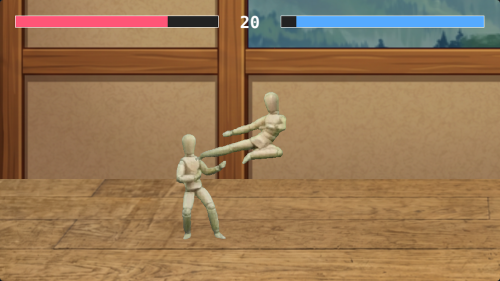
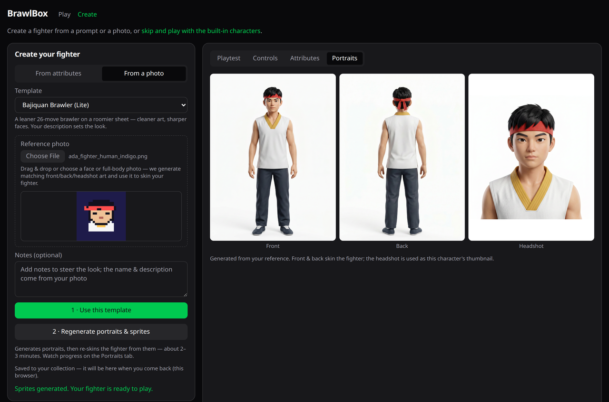
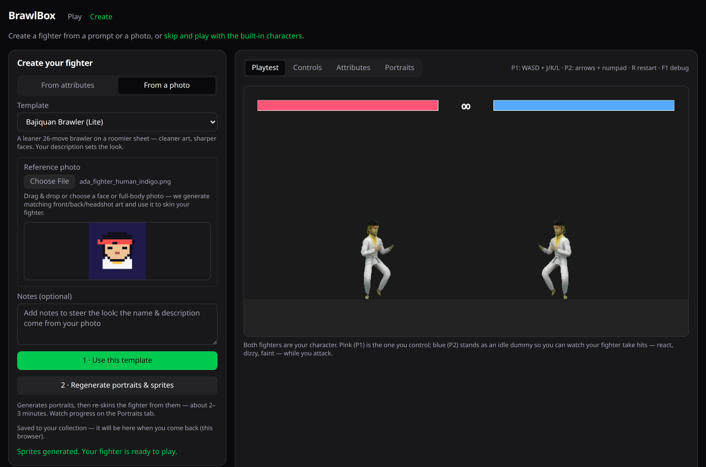

# BrawlBox

Browser-native 2D fighting game with a **deterministic engine** and an **AI-assisted character
creator**. Describe a fighter in plain language and play it in a real fighting-game engine — no
install, runs in the browser.

**Play the hosted version:** https://brawlbox.gg



## How it works

**1 · Upload a photo (or describe a fighter).** The creator turns it into a consistent character — front, back, and headshot — generated with your own AI keys, right in the browser.



**2 · It becomes a playable fighter.** The portraits skin a full moveset onto a real character. Tweak stats, play it instantly, and it's saved under *My characters* to replay or edit later.



**3 · Fight in a deterministic engine.** Pure 60Hz `tick`, rollback-ready — the same engine whether the fighter was AI-generated or hand-authored (see the action shot above).

## Quick start (runs locally, zero backend)

```sh
git clone https://github.com/ada-powerful/brawlbox
cd brawlbox
bun install
bun dev
```

Open **http://localhost:5173/sandbox.html** — the deterministic engine, a demo fighter, and a CPU
opponent run with no setup at all: no cloud, no API keys, no account.

> Uses [Bun](https://bun.sh). `bun test` runs the suite; `bun run typecheck` type-checks.

## Generate your own fighter (BYOK)

The **entire creator runs locally in your browser** with your own API keys — no proxy, no account.
Keys are sent only to the model providers (OpenAI, [fal.ai](https://fal.ai)), never to a BrawlBox
server, and generated fighters are saved on your device.

- **From a prompt or attributes** — an OpenAI key designs a complete, playable character (moves,
  stats, behavior).
- **From a photo** — drop in a face or full-body photo; with an OpenAI **and** a fal.ai key the
  creator generates front/back/headshot portraits and re-skins a full sprite sheet (nano-banana-2),
  entirely client-side.
- Generated fighters persist in the browser (IndexedDB) and appear under **My characters** to
  replay, rename, or edit.

Enter the keys in the creator's key cards, or for local dev put `OPENAI_API_KEY` / `FAL_API_Key`
in a `.env`. The hosted version at [brawlbox.gg](https://brawlbox.gg) adds accounts, cross-device
cloud saves, and a public gallery.

## What's inside

| Path | What |
| --- | --- |
| `src/engine` | The deterministic core: a pure `tick`, character schema as source of truth. |
| `src/render` | Pixi.js rendering, canonical action vocabulary, procedural poses. |
| `src/runtime` | rAF loop + interpolation + the input-layer CPU opponent. |
| `src/creator` | React creator UI, BYOK AI clients, template pipeline. |
| `src/sandbox` | Backend-free local test harness (`sandbox.html`). |

Built with **Pixi.js · TypeScript · React · Vite · Bun**.

## License

- **Code:** [MIT](LICENSE)
- **Bundled art assets** (the wooden-mannequin demo character, stages): [CC0-1.0](ASSETS.md) — public domain.

The **"BrawlBox" name and logo** are trademarks of the project author and are not covered by the
MIT license.
